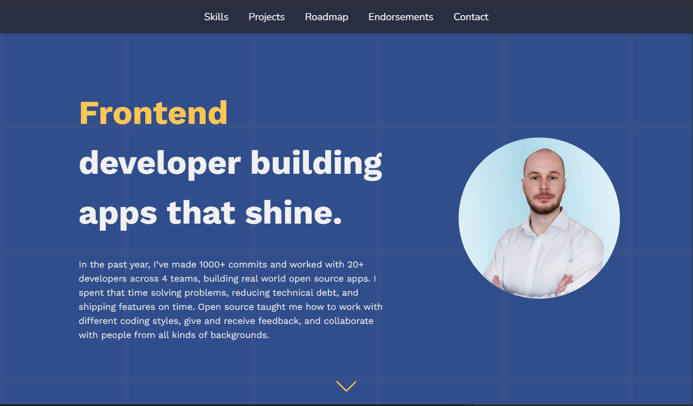

# Portfolio

# 🔗 [Live preview]()

---

## Table of Contents

- [About](#about)
- [Sections](#sections)
- [Technologies & Dependencies used](#technologies--dependencies-used)
- [Contact](#contact)
- [Special Thanks](#special-thanks)

---

### About

Welcome to my portfolio website. It showcases my skills, experience, and projects as a frontend developer. Built with React, Tailwind CSS, and modern tooling, it serves as both a resume and a demonstration of my work and coding style.

---

### Sections

- **Hero**: A quick hello and what I’m all about as a developer.

- **About**: A bit more about my journey so far, my background, experience, and strengths as a developer.

- **Skills**: See a visual list of my technical skills and tools I use.

- **Projects**: Some of the projects I’m proud of, whether I built them solo or with a team. You’ll find live demos and source code here too.

- **Roadmap**: A look at where I’m headed. Skills I’m learning, things I want to build next, and goals I’m working toward.

- **Endorsements**: Kind words from people I’ve worked with. Teammates, mentors, and collaborators who’ve seen me in action.

- **FAQ**: Answers to common questions about my experience, workflow, and what value I bring to the team.

- **Footer**: Answers to common questions about my experience, workflow, and what value I bring to the team.

---

### Technologies & Dependencies used

- **React**: UI library
- **Tailwind CSS**: CSS framework for styling
- **React Router**: Routing
- **Formspree**: Contact form backend
- **Framer Motion**: Animations
- **Vite**: Fast build tool
- **React Icons**: Icon library
- **React Hot Toast**: Toast notifications

 

**dependencies:**

- "@formspree/react": "^3.0.0",
- "framer-motion": "^11.13.1",
- "react": "^18.3.1",
- "react-dom": "^18.3.1",
- "react-hot-toast": "^2.5.2",
- "react-icons": "^5.4.0",
- "react-router-dom": "^7.1.1",
- "swiper": "^11.1.15"

**devDependencies:**

- "@eslint/js": "^9.15.0",
- "@types/react": "^18.3.12",
- "@types/react-dom": "^18.3.1",
- "@vitejs/plugin-react": "^4.3.4",
- "autoprefixer": "^10.4.20",
- "eslint": "^9.15.0",
- "eslint-plugin-react": "^7.37.2",
- "eslint-plugin-react-hooks": "^5.0.0",
- "eslint-plugin-react-refresh": "^0.4.14",
- "globals": "^15.12.0",
- "postcss": "^8.4.49",
- "prettier": "^3.5.3",
- "prettier-plugin-tailwindcss": "^0.6.11",
- "tailwindcss": "^3.4.16",
- "vite": "^6.0.1"

---

### Contact

Want to get in touch or learn more about me?

Email: predrag.jandric.bg@gmail.com

[My Youtube Channel](https://www.youtube.com/@predragjandric)

[My Linkedin](https://www.linkedin.com/in/predrag-jandric/)

---

### Special Thanks

To Chingu.io, for giving me the chance to work on real projects with real people, and helping me grow through collaboration and feedback.

All the teammates, mentors, and reviewers I’ve worked with.

The open-source community, for being such a welcoming place to learn, build, and contribute.

---

<!-- Some dev related recources

hero pattern got from:
https://patternico.com/#meM0W5EUKUjVsnNY

3rd party used to make form functionable:
https://formspree.io/

3d got from (was used for old version of portfolio):
https://sketchfab.com -->
